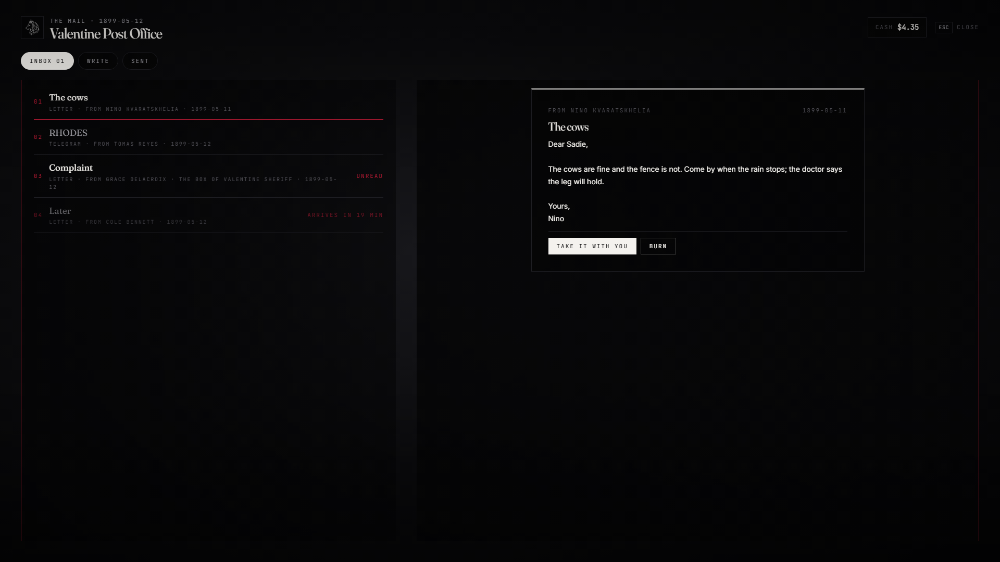

# lxr-post — The mail, for LXRCore

A letter is written at a post office, costs a stamp, and travels — it is
waiting at any office after the delay. A telegram costs by the word and
is there at once. Mail is addressed to a person by name, or to a trade's
box that every member on the roll can read. Collected letters are catalog
items the reader opens; the unread count sits in a state bag for the frame.



## What it does

* **Write** — letter (`stamp`, `deliveryMinutes`) or telegram (`perWord`, `minimum`, `maxWords`); the clerk finds people by name (three letters), or you pick a trade box.
* **Inbox** — what has arrived, what is still on the road, unread marks; read at the desk, **take it with you** (becomes the `letter` / `telegram` item with the text inside — use it to read anywhere), or burn it.
* **Sent** — your outgoing mail and whether it has arrived.
* **Trade boxes** — `Config.Boxes`: mail to `job:<name>` that the roll reads; grade-gated.
* **The frame** — `Player(src).state.mail` / `LocalPlayer.state.mail` is the unread count; the HUD may show it.
* **Events / exports** — `lxr:post:sent`; `Send(address, fromName, kind, subject, body)` lets any resource post mail (a bounty notice, a bank letter); `Unread(src)`.

## Install

```cfg
ensure lxr-core
ensure lxr-interact
ensure lxr-post
```

The table `lxr_post_mail` is created by the core migration runner.

## Building the interface

Vite + React + TypeScript: source in `ui/`, built output in `html/` (`cd ui && npm install && npm run build`). `style.css` uses kit tokens only; `tools/kit_check.py` guards it.

## Licence

© 2026 iBoss21 / LXRCore — All Rights Reserved. See `LICENSE`.
